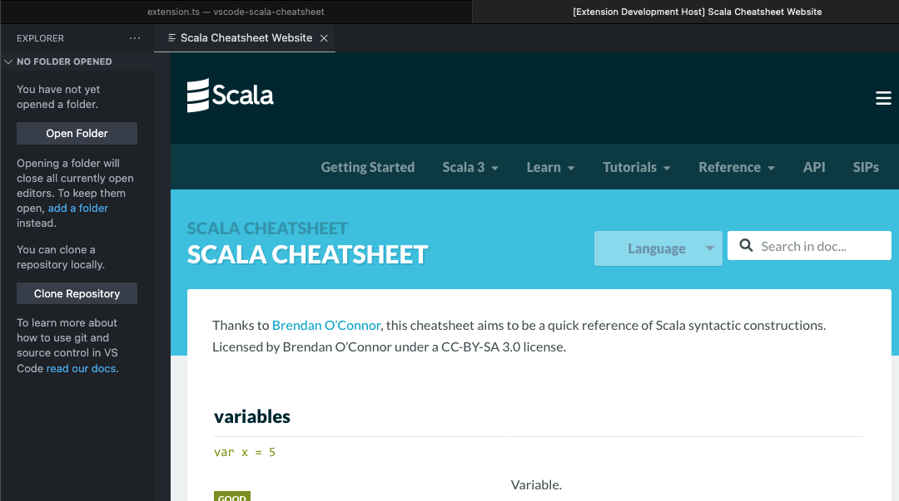

# [Scala Cheatsheet](https://marketplace.visualstudio.com/items?itemName=jojoee.scala-cheatsheet)
A Visual Studio Code extension that lets you open Scala cheatsheet inside the editor.

[](https://marketplace.visualstudio.com/items?itemName=jojoee.scala-cheatsheet)
[](https://marketplace.visualstudio.com/items?itemName=jojoee.scala-cheatsheet)
[](https://marketplace.visualstudio.com/items?itemName=jojoee.scala-cheatsheet)



## Features
- `Scala Cheatsheet: Website` to open website inside editor

## TODO
- [ ] Add https://gist.github.com/heathermiller/2ab9ef36910fdfdd20e9
- [ ] Automated: test
- [ ] Refactoring

## Demo
1. Basic usage + feature
- `alt + shift + P` to open available commands
- Select for open "Webview"
- Click to "Sharing Environments" section
- Hover on some command
- Click it for copy the command
- `alt + N` to create new file
- `alt + V` to pate the command
2. Support theme changing
3. Support other view e.g. PDF and website

## Development
```
npm run compile
npm run test
npm run deploy
vsce login jojoee
vsce publish
```

## Reference
- [Scala Cheatsheet](https://docs.scala-lang.org/cheatsheets/index.html)
